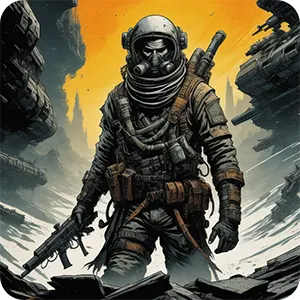

# Vagabond

## Introduction

<picture>
  
</picture>

Welcome to Vagabond RPG, an immersive tabletop roleplaying game set in a vast and dynamic science fiction universe. In this game, players will take on the roles of diverse characters navigating the complexities of space, technology, and the unknown. Whether you're a seasoned roleplayer or just stepping into the realm of science fiction RPGs, Vagabond RPG offers an exciting and rich experience.

## Chapter 1: Character Creation

### 1.1 Species
Choose from a variety of species each with unique traits and abilities. Are you a cybernetic-enhanced human, a telepathic alien, or a sentient AI? The species you select influences your character's strengths and weaknesses.

Choose your character's species, each offering unique traits and abilities:

#### 1.1.1 Human (Baseline)
* **Adaptive Nature**: Humans gain a +1 bonus to any two attributes of their choice.
* **Versatility**: Humans start with one additional skill point during character creation.

#### 1.1.2 Synthetics (AI or Android)
* **Analytical Mind**: Synthetics gain a +2 bonus to Intelligence.
* **Machine Resilience**: Synthetics have resistance against mind-altering effects.

#### 1.1.3 Psion (Telepathic Alien)
* **Telepathic Connection**: Psions can communicate telepathically with others of their kind within a range of 30 meters.
* **Psionic Potential**: Psions can choose one psionic ability during character creation.

#### 1.1.4 Chimeran (Genetically Enhanced)
* **Hybrid Physiology**: Chimerans gain a +1 bonus to two different attributes.
* **Genetic Adaptation**: Chimerans have advantage rolls against environmental hazards.

#### 1.1.5 Revenant (Undead or Reanimated)
* **Unyielding Endurance**: Revenants gain resistance to physical damage.
* **Life Drain**: Revenants can drain life force from opponents, restoring a portion of their health.

#### 1.1.6 Aquarion (Aquatic Species)
* **Aquatic Affinity**: Aquarions can breathe underwater and have a swimming speed of 40 feet.
* **Amphibious**: Aquarions are equally comfortable on land and in water.
Choose a species that aligns with your character concept. Each species comes with its own set of challenges and advantages, contributing to the rich tapestry of the Galaxy Nexus universe.

### 1.2 Background
Define your character's backstory, detailing their past experiences, affiliations, and key events that shaped them. Background choices impact skills, relationships, and motivations.

Define your character's past experiences, affiliations, and key events that shaped them. Background choices impact skills, relationships, and motivations.

#### 1.2.1 Galactic Peacekeeper
* **Skill Proficiencies**: Firearms, Diplomacy
* **Equipment**: Standard issue galactic peacekeeper armor and sidearm.

#### 1.2.2 Space Explorer
* **Skill Proficiencies**: Piloting, Survival
* **Equipment**: Explorer's toolkit, advanced navigation system.

#### 1.2.3 Corporate Operative
* **Skill Proficiencies**: Technology, Negotiation
* **Equipment**: Corporate identity card, encrypted communication device.

#### 1.2.4 Rogue Scientist
* **Skill Proficiencies**: Cybernetics, Science
* **Equipment**: Portable laboratory, experimental gadget.

#### 1.2.5 Mercenary Nomad
* **Skill Proficiencies**: Stealth, Melee Combat
* **Equipment**: Customized combat suit, versatile melee weapon.

#### 1.2.6 Alien Diplomat
* **Skill Proficiencies**: Linguistics, Diplomacy
* **Equipment**: Translator device, diplomatic credentials.

Choose a background that not only fits your character concept but also complements your chosen species and profession.

### 1.3 Profession
Determine your character's profession, ranging from skilled pilots and engineers to diplomats and mercenaries. Professions grant specialized skills and access to unique abilities.

Determine your character's profession, which grants specialized skills and access to unique abilities.

#### 1.3.1 Space Mercenary
* **Combat Training**: Proficiency with a variety of firearms.
* **Tactical Awareness**: Gain a +1 bonus to initiative rolls.

#### 1.3.2 Techno-Hacker
* **Technological Prowess**: Proficiency with hacking tools and cyber warfare.
* **Enhanced Cybernetics**: Access to unique cybernetic upgrades.

#### 1.3.3 Galactic Diplomat
* **Negotiation Mastery**: Proficiency in negotiation and diplomacy.
* **Diplomatic Immunity**: Gain advantage on social interaction checks with legal authorities.

#### 1.3.4 Stellar Explorer
* **Piloting Expertise**: Proficiency in piloting spacecraft.
* **Surveyor's Eye**: Gain advantage on navigation and exploration checks in space.

#### 1.3.5 Android Infiltrator
* **Stealth Integration**: Proficiency in stealth and infiltration.
* **Mimicry Protocol**: Gain advantage on deception checks to appear human.

#### 1.3.6 Psionic Adept
* **Psionic Proficiency**: Gain proficiency in one psionic ability.
* **Telepathic Insight**: Gain advantage on insight checks related to detecting lies.

Choose a profession that aligns with your character's skills and motivations, ensuring a seamless integration with your selected background and species.

### 1.4 Attributes:
Allocate points to attributes such as Strength, Dexterity, Intelligence, and Charisma. These attributes influence your character's capabilities and contribute to various checks and challenges.

Allocate points to the following attributes, determining your character's capabilities:

* **Strength (STR)**: Represents physical power and melee combat prowess.
* **Dexterity (DEX)**: Governs agility, reflexes, and ranged combat skill.
* **Intelligence (INT)**: Reflects cognitive abilities, problem-solving, and knowledge.
* **Charisma (CHA)**: Measures charm, persuasiveness, and leadership.

Allocate a total of 20 points among these attributes, with no single attribute exceeding 14 during character creation.

### 1.5 Skills
Select skills based on your character's background and profession. Skills range from technical expertise to social manipulation, reflecting the diverse challenges of the galaxy.

#### 1.5.1 Firearms
* **Basic Proficiency**: Able to use standard firearms effectively.
* **Advanced Marksmanship**: Gain a +1 bonus to firearm attacks.

#### 1.5.2 Piloting
* **Starship Maneuvering**: Proficient in piloting spacecraft.
* **Evasive Actions**: Gain a +1 bonus to piloting checks during evasive maneuvers.

#### 1.5.3 Negotiation
* **Diplomatic Prowess**: Skilled in negotiation and persuasion.
* **Smooth Talker**: Gain advantage on negotiation checks.

#### 1.5.4 Cybernetics
* **Technological Augmentation**: Proficient in the use of cybernetic enhancements.
* **Cybernetic Maintenance**: Gain a +1 bonus to checks related to cybernetic systems.

Choose skills that complement your character's profession and playstyle, ensuring a well-rounded and capable character.

## Chapter 2: Gameplay Mechanics

### 2.1 Core Mechanic
Roll a twenty-sided die (d20) for most actions. Add relevant modifiers from attributes, skills, and other sources to meet or exceed a target number determined by the Game Master (GM). The core mechanic ensures simplicity and consistency throughout the game.

### 2.2 Combat
Engage in dynamic and strategic combat using a turn-based system. Actions include attacks, dodges, and special abilities. Tactical positioning and cover play a crucial role in survival.

#### 2.2.1 Initiative
At the beginning of combat, roll for initiative (1d20 + Dexterity modifier). The order determines when characters and enemies take their turns.

#### 2.2.2 Attack and Defense
* **Attack Rolls**: Roll 1d20, add relevant modifiers (e.g., Dexterity for ranged attacks, Strength for melee), and compare against the target's Armor Class (AC).

    *Example*: To hit an opponent with an AC of 15, you need to roll 15 or higher on the d20.
* **Damage Rolls**: Once a successful attack is confirmed, roll damage based on the weapon or ability used.
* **Defense Rolls**: When targeted, roll a defense check (1d20 + Dexterity modifier for dodging). Meet or exceed the opponent's attack roll to avoid damage.

#### 2.2.3 Cover and Positioning
* **Cover Bonus**: Gain a bonus to Defense rolls based on cover quality (partial, half, or full cover).
* **Flanking**: Gain advantage on attack rolls when flanking an opponent with an ally.

### 2.3 Technology and Equipment
Explore a vast array of futuristic weapons, gadgets, and spacecraft. Customize and upgrade your equipment as you progress, enhancing your character's capabilities.

#### 2.3.1 Weapon Customization
* **Attachments**: Attach scopes, silencers, or other mods to enhance weapon performance.
* **Upgrades**: Invest in advanced technology to improve damage, accuracy, or add special effects.

#### 2.3.2 Gadgets
* **Utility Tools**: Carry devices like scanners, hacking tools, or medical kits for various situations.
* **Personal Shields**: Deploy protective shields for temporary defensive boosts.

#### 2.3.3 Spaceships
* **Customization**: Upgrade your spaceship's weapons, shields, and engines for improved performance.
* **Crew Management**: Assign roles to crew members for bonuses during space encounters.

### 2.4 Spaceship Mechanics
Experience space travel and engage in interstellar conflicts with detailed spaceship rules. Navigate through star systems, manage resources, and engage in epic space battles.

#### 2.4.1 Navigation
* **Star Maps**: Plan routes using detailed star maps, considering fuel efficiency and potential hazards.
* **Hyperspace Travel**: Enter hyperspace for faster-than-light travel, but beware of navigational challenges.

#### 2.4.2 Space Combat
* **Ship Actions**: Choose from a variety of ship actions, including evasive maneuvers, targeting, and electronic warfare.
* **Boarding**: Engage in ship-to-ship combat and boarding actions for close encounters.

### 2.5 Augmentations and Cybernetics
Embrace technological enhancements to augment your character's abilities. From cybernetic limbs to neural implants, choose enhancements that align with your playstyle.

#### 2.5.1 Cybernetic Enhancements
* **Enhanced Strength**: Replace limbs for increased strength, granting bonuses to melee damage.
* **Neural Interface**: Access information directly, gaining advantages on Intelligence-based checks.

#### 2.5.2 Psionic Implants
* **Telepathic Amplifier**: Boost telepathic abilities, extending communication range.
* **Psionic Barrier**: Develop a protective barrier against mental attacks.

## Chapter 3: Personality Elements

### 3.1 Traits
Define your character's unique traits, such as bravery, curiosity, or cynicism. Traits influence roleplaying and provide bonuses or penalties in certain situations.

#### 3.1.1 Fearless
* **Effect**: +2 bonus to fear-related checks.
* **Application**: Fear-based scenarios, such as encountering frightening creatures or navigating hazardous environments.

#### 3.1.2 Inquisitive
* **Effect**: +1 bonus to investigation and knowledge checks.
* **Application**: Gathering information, studying ancient artifacts, or deciphering unknown technology.

#### 3.1.3 Stoic
* **Effect**: Immunity to intimidation, but -1 penalty to charisma-based social interactions.
* **Application**: Remaining calm under pressure but struggling in social situations.

### 3.2 Morality
Navigate moral dilemmas with a morality system that affects your character's alignment and relationships. Make choices that shape your character's moral compass.

#### 3.2.1 Alignment
* **Good**: Prioritizes altruism, compassion, and justice.
* **Neutral**: Balances self-interest with empathy.
* **Evil**: Embraces selfishness, cruelty, and disregard for others.

#### 3.2.2 Morality Scale
* **Scale**: 1 (Malevolent) to 10 (Benevolent).
* **Effects**: Certain abilities or interactions may be influenced by your character's current morality level.

### 3.3 Relationships
Establish connections with other player characters, NPCs, and factions. Build alliances, rivalries, or romances that impact the narrative and offer opportunities for collaborative storytelling.

#### 3.3.1 Ally
* **Nature**: Trusted friend and reliable source of scientific knowledge.
* **Benefits**: +2 bonus on collaborative scientific endeavors.

#### 3.3.2 Rival
* **Nature**: Competitive relationship with a history of clashes.
* **Challenges**: -1 penalty on interactions with Captain Zara, but potential benefits from outsmarting or besting her.

## Chapter 4: Sample Character

**Name:** Captain Sera Nova  
**Species:** Human (Cybernetically Enhanced)  
**Background:** Former Galactic Peacekeeper  
**Profession:** Space Mercenary  
**Attributes:**
  - Strength: 14
  - Dexterity: 16
  - Intelligence: 12
  - Charisma: 10

**Skills:**
  - Firearms: 3
  - Piloting: 4
  - Negotiation: 2
  - Cybernetics: 3

**Traits:**
  - Fearless: +2 to fear-related checks
  - Cynical: -1 to trust-based social interactions

**Morality:**
  - Alignment: Neutral
  - Current Morality: 7 (on a scale of 1-10)

**Relationships:**
  - Ally: Dr. Aria Talon (Scientist)
  - Rival: Captain Zara Black (Space Pirate)

Captain Sera Nova, a human with cybernetic enhancements, brings a mix of combat prowess, piloting skills, and a fearless attitude to the Galaxy Nexus universe. Her connections and rivalries add depth to her character, shaping her interactions within the vastness of space.

## Chapter 5: Sample Scene

### Scene: Aboard the Stargazer, Captain Sera Nova's Spaceship

The Stargazer hurtles through the cosmos, pursued by a squadron of pirate ships. Captain Sera Nova, her cybernetic eyes focused on the tactical display, barks orders to her crew. As the enemy closes in, Sera decides to take matters into her own hands.

**Captain Sera Nova's Personality Elements in Action:**

**Fearless Trait**: Sera orders a risky maneuver, pushing the Stargazer to its limits. The GM calls for a piloting check, and Sera's Fearless trait provides a +2 bonus, ensuring the ship successfully evades the enemy's fire.

**Cynical Trait**: Amidst the chaos, an unknown distress signal reaches the Stargazer. Sera's Cynical trait prompts her to doubt the authenticity of the message. She decides to proceed cautiously, avoiding a potential trap.

**Relationships**: Remembering her alliance with Dr. Aria Talon, Sera contacts the ship's scientist for assistance. A successful negotiation check, boosted by their established relationship, leads to valuable information about a hidden asteroid field that could provide cover.

As the Stargazer navigates the asteroid field, the pirate ships scatter, unable to pursue. Sera Nova's fearless leadership, cautious skepticism, and strategic use of alliances showcase the dynamic interplay of personality elements in Galaxy Nexus. The crew breathes a collective sigh of relief as the Stargazer escapes the clutches of danger, leaving behind a trail of defeated adversaries in the vastness of space.

## Chapter 6: Advanced Rules

### 6.1 Psionics and Telepathy:
Explore the realm of psionics and telepathy, granting characters access to extraordinary mental abilities. Engage in mind battles, communicate silently, or manipulate the thoughts of others.

#### 6.1.1 Psionic Abilities
* **Telekinesis**: Move objects with the power of the mind.
* **Mind Shield**: Protect against mental intrusions and psychic attacks.
Telepathic Communication: Communicate silently with others.

#### 6.1.2 Telepathic Battles
* **Initiation**: Both parties roll a psionics check (1d20 + Intelligence modifier).
* **Effects**: Successful attacks can cause mental damage, confusion, or temporary incapacitation.

### 6.2 Galactic Economy
Delve into the intricacies of the galactic economy. Engage in trade, establish business ventures, and navigate the economic landscape to accumulate wealth and resources for your character and crew.

#### 6.2.1 Trade Routes
* **Profitable Routes**: Identify and exploit lucrative trade routes for maximum profit.
* **Risk and Reward**: Balance potential earnings with the dangers of piracy and economic instability.

#### 6.2.2 Business Ventures
* **Investments**: Use acquired wealth to invest in businesses, yielding passive income.
* **Corporate Espionage**: Engage in covert activities to gain advantages in the market.

### 6.3 Diplomacy and Politics
Navigate the complexities of interstellar diplomacy and politics. Build alliances, negotiate treaties, or engage in espionage to influence the balance of power in the galaxy.

#### 6.3.1 Alliance Building
* **Negotiation**: Diplomatic checks to secure alliances with factions or star systems.
* **Maintaining Relations**: Perform actions to strengthen or strain diplomatic ties.

#### 6.3.2 Espionage
* **Infiltration**: Use stealth and subterfuge to gather intelligence.
* **Sabotage**: Disrupt the operations of rival factions to gain a strategic advantage.

### 6.4 Planetary Exploration
Embark on planetary expeditions, uncovering ancient ruins, encountering new species, and discovering hidden technologies. Manage environmental hazards and engage in exploration-based challenges.

#### 6.4.1 Hazardous Environments
* **Toxic Atmospheres**: Use protective gear or skills to navigate poisonous atmospheres.
* **Extreme Temperatures**: Adapt to and overcome extreme heat or cold conditions.

#### 6.4.2 Discovery and Interaction
* **Ancient Artifacts**: Uncover relics with potential technological or historical significance.
* **New Lifeforms**: Encounter and interact with unique planetary inhabitants.

## Chapter 7: Game Master's Guide

### 7.1 Creating Campaigns
Guidelines for GMs on crafting engaging campaigns, developing intriguing plotlines, and creating memorable NPCs to enrich the player experience.

#### 7.1.1 Setting Design
* **Galactic Map**: Develop a detailed map with diverse star systems, each offering unique challenges and opportunities.
* **Factional Dynamics**: Create political, economic, and cultural dynamics among factions for a living, breathing galaxy.

#### 7.1.2 Plot Arcs
* **Main Plot**: Outline a central narrative, such as unraveling a cosmic mystery or preventing an impending galactic war.
* **Side Quests**: Introduce compelling side quests to enhance character development and world-building.

#### 7.1.3 Player Agency
* **Branching Narratives**: Allow for player decisions to impact the direction of the story.
* **Consequences**: Implement consequences for both success and failure, creating a dynamic narrative.

### 7.2 Adapting to Player Choices
Learn how to dynamically adjust the narrative based on player decisions. Explore branching storylines and consequences that enhance player agency and immersion.

#### 7.2.1 Dynamic NPCs
* **Evolve Relationships**: NPCs should respond to player actions, developing alliances, or becoming adversaries.
* **Unique Personalities**: Infuse NPCs with distinct personalities, motivations, and quirks.

#### 7.2.2 Sandbox Elements
* **Open Exploration**: Allow players to explore the galaxy freely, discovering hidden secrets and encountering unexpected challenges.
* **Player-Driven Plot**: Incorporate elements that respond to player initiatives, allowing them to shape the story.

### 7.3 Balancing Encounters:
Master the art of encounter design, ensuring challenges are appropriately matched to the characters' abilities. Understand how to create tension and excitement without overwhelming or underwhelming the players.

#### 7.3.1 Encounter Difficulty
* **Challenge Rating**: Assign appropriate CRs to encounters based on the characters' level.
* **Scaling Difficulty**: Adjust encounters on the fly to maintain a balance between challenge and enjoyment.

#### 7.3.2 Variety in Encounters
* **Combat and Non-Combat Challenges**: Mix combat encounters with puzzles, negotiations, or diplomatic challenges.
* **Environmental Hazards**: Utilize the environment to add complexity to encounters.

## Chapter 8: Sample Adventure

### Title: Shadows of the Celestial Nexus

### Synopsis

The crew of the Stargazer stumbles upon a mysterious artifact that holds the key to an ancient prophecy. As they investigate, they become entangled in a web of political intrigue, uncovering a plot that could reshape the fate of the galaxy.

### Adventure Highlights

1. Unravel the secrets of the Celestial Nexus.
    * Discover the origin and purpose of the ancient artifact.
    * Decipher cryptic messages leading to hidden locations.
2. Navigate through a city of floating platforms on the gas giant's upper atmosphere.
    * Encounter unique challenges in a floating metropolis suspended in the clouds.
    * Uncover the city's secrets and its connection to the artifact.
3. Confront a cult seeking to exploit the artifact's power.
    * Engage in covert operations to infiltrate the cult's hideout.
    * Face off against cult leaders with mysterious powers and twisted motivations.

### Adventure Progression
1. Artifact Discovery:
    * The crew finds the artifact on a desolate planet during a routine mission.
    * Strange occurrences and visions begin as the artifact's power manifests.
2. Floating City Exploration:
    * Following clues, the crew arrives at the gas giant's floating city.
    * Encounter floating markets, aerial races, and the enigmatic leaders of the city.
3. Cult Infiltration:
    * Uncover the existence of a cult seeking to exploit the artifact.
    * Infiltrate the cult's base, navigating traps and facing devoted cultists.
4. Celestial Nexus Chamber:
    * Reach the heart of the Celestial Nexus, the artifact's source.
    * Confront the mysterious figure revealed in Captain Sera Nova's visions.

### Adventure Resolution
1. Artifact's Purpose:
    * The crew learns the artifact is a key to a dimensional gateway.
    * Decide whether to close the gateway, harness its power, or destroy the artifact.
2. City's Revelation:
    * The floating city's leaders reveal its true nature as an ancient spacefaring vessel.
    * The crew gains the option to use the city as their own mobile base.
3. Cult Consequences:
    * The cult's fate depends on the crew's actions.
    * Future encounters may involve remnants of the cult seeking revenge or redemption.

## Chapter 9: Advanced Sample Scene

### Scene: The Celestial Nexus Chamber

Captain Sera Nova and her crew find themselves within the heart of the Celestial Nexus, a chamber bathed in ethereal light. Ancient symbols glow on the walls, and a mysterious figure emerges from the shadows.

### Sera Nova's Personality Elements in Action:

**Psionics**: The mysterious figure attempts to probe the crew's minds. Sera, with her psionic resistance gained through experience, resists the intrusion, protecting herself and her crew from mental manipulation.

**Galactic Economy**: In a diplomatic twist, a representative from a powerful corporation offers the crew a substantial reward for handing over the artifact. Sera weighs the options, considering the potential benefits for her crew and ship.

**Diplomacy and Politics**: A political envoy from a nearby star system arrives, seeking an alliance against a common foe. Sera engages in negotiations, utilizing her skills to secure support and potential resources for the upcoming challenges.

As the scene unfolds, Sera Nova's diverse personality elements come into play, shaping the outcome of the encounter within the mystical Celestial Nexus Chamber.